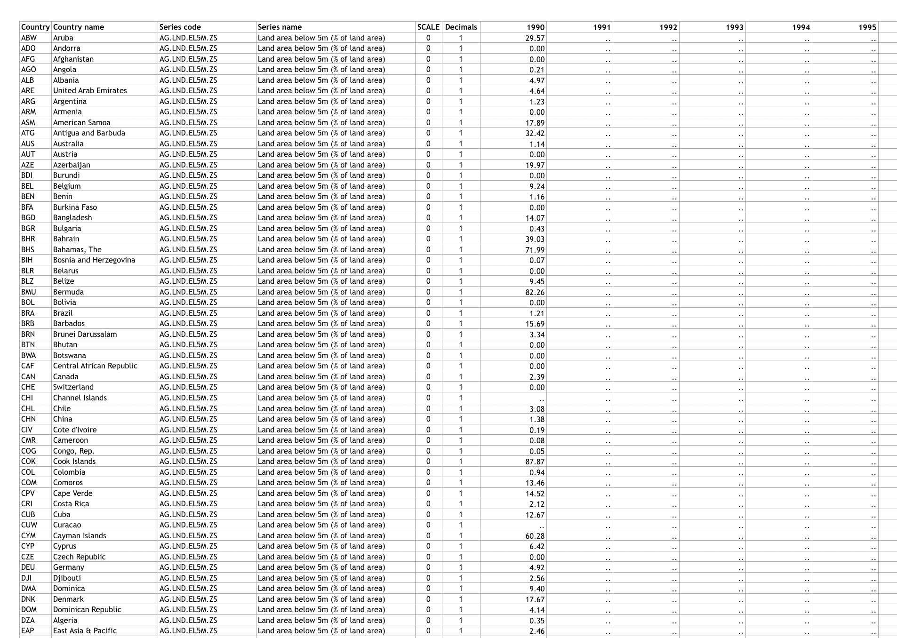

```{r setup, include=FALSE}
knitr::opts_chunk$set(echo = FALSE,message = FALSE,warning = FALSE, results= "asis")
pacman::p_load(ggplot2,dplyr,reshape2,plotly,DT,htmlwidgets)
```
## Original Dataset{#font-color}
Looks like this: 
<center>

</center>

## Original Dataset

* <b>xls file</b><br />
<br />
* <b>3 sheets:</b><br />

  + 13512 obs., 28 variables
  
  + 233 obs., 6 variables
  
  + 58 obs., 8 variables

## Import data and Visual sheet 1

```{r}
ClimateRaw1 = readxl::read_xls("Climate_Change.xls",sheet = 1,na = "..",col_types = "guess")
raw1 <- datatable(ClimateRaw1%>%sample_n(20,replace = FALSE),
                  options = list(
                    autoWidth = TRUE,
                    pageLength = 3,
                    columnDefs = list(list(className = 'dt-center', targets = c(1,2,4)))
                    )
                  )
path <- file.path(getwd(), "Raw1.html")
htmlwidgets::saveWidget(as_widget(raw1), file = path)
```
<iframe src="Raw1.html"></iframe>

## Import data and Visual sheet 2
```{r}
ClimateRaw2 = readxl::read_xls("Climate_Change.xls",sheet = 2,na = "..",col_types = "guess")
raw2 <- datatable(ClimateRaw2%>%sample_n(20,replace = FALSE),
                  options = list(
                    autoWidth = TRUE,
                    pageLength = 5,
                    columnDefs = list(list(className = 'dt-center', targets = c(1,2,3)))
                    )
                  )
path <- file.path(getwd(), "Raw2.html")
htmlwidgets::saveWidget(as_widget(raw2), file = path)
```
<iframe src="Raw2.html"></iframe>

## Import data and Visual sheet 3
```{r}
ClimateRaw3 = readxl::read_xls("Climate_Change.xls",sheet = 3,na = "..",col_types = "guess")
raw3 <- datatable(ClimateRaw3%>%sample_n(20,replace = FALSE),options = list(
  autoWidth = TRUE,
  pageLength = 5,
  columnDefs = list(
    list(className = 'dt-center', targets = c(1,3,4)),
    list(targets = c(2,7,8),
         render = JS("function(data, type, row, meta) {",
                     "return type === 'display' && data.length > 10 ?",
                     "'<span title=\"' + data + '\">' + data.substr(0, 10) + '...</span>' : data;",
                     "}")
         )
    )
  )
  )
path <- file.path(getwd(), "Raw3.html")
htmlwidgets::saveWidget(as_widget(raw3), file = path)
```
<iframe src="Raw3.html"></iframe>

## R Markdown

This is an R Markdown presentation. Markdown is a simple formatting syntax for authoring HTML, PDF, and MS Word documents. For more details on using R Markdown see <http://rmarkdown.rstudio.com>.

When you click the **Knit** button a document will be generated that includes both content as well as the output of any embedded R code chunks within the document.

## Slide with Bullets

- Bullet 1
- Bullet 2
- Bullet 3

## Slide with R Output

```{r cars}
d=datatable(mtcars)
path <- file.path(getwd(), "cars.html")
htmlwidgets::saveWidget(as_widget(d), file = path)
```
<iframe src="cars.html"></iframe>
## Slide with Plot

```{r pressure}
p <- plotly_build(ggplot(pressure)+aes(x = temperature, y = pressure)+geom_point())

path <- file.path(getwd(), "pressure.html")
htmlwidgets::saveWidget(as_widget(p), file = path)
```
<iframe src="pressure.html"></iframe>


